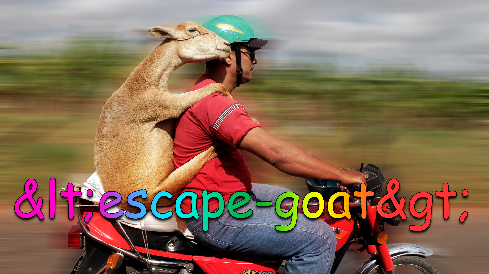

<h1>
	
</h1>

> Escape a string for use in HTML or the inverse

[](https://travis-ci.org/sindresorhus/escape-goat)


## Install

```
$ npm install escape-goat
```


## Usage

```js
const escapeGoat = require('escape-goat');

escapeGoat.escape('🦄 & 🐐');
//=> '🦄 &amp; 🐐'

escapeGoat.unescape('🦄 &amp; 🐐');
//=> '🦄 & 🐐'

escapeGoat.escape('Hello <em>World</em>');
//=> 'Hello &lt;em&gt;World&lt;/em&gt;'

const url = 'https://sindresorhus.com?x="🦄"';
escapeGoat.escapeTag`<a href="${url}">Unicorn</a>`;
//=> '<a href="https://sindresorhus.com?x=&quot;🦄&quot;">Unicorn</a>'
```


## API

### escapeGoat.escape(input)

Escapes the following characters in the given `input` string: `&` `<` `>` `"` `'`

### escapeGoat.unescape(input)

Unescapes the following HTML entities in the given `input` string: `&amp;` `&lt;` `&gt;` `&quot;` `&#39;`

### escapeGoat.escapeTag

[Tagged template literal](https://developer.mozilla.org/en/docs/Web/JavaScript/Reference/Template_literals#Tagged_template_literals) that escapes interpolated values.

### escapeGoat.unescapeTag

[Tagged template literal](https://developer.mozilla.org/en/docs/Web/JavaScript/Reference/Template_literals#Tagged_template_literals) that unescapes interpolated values.

## Tip

Ensure you always quote your HTML attributes to prevent possible [XSS](https://en.wikipedia.org/wiki/Cross-site_scripting).


## FAQ

### Why yet another HTML escaping package?

I couldn't find one I liked that was tiny, well-tested, and had both `.escape()` and `.unescape()`.


## License

MIT © [Sindre Sorhus](https://sindresorhus.com)
